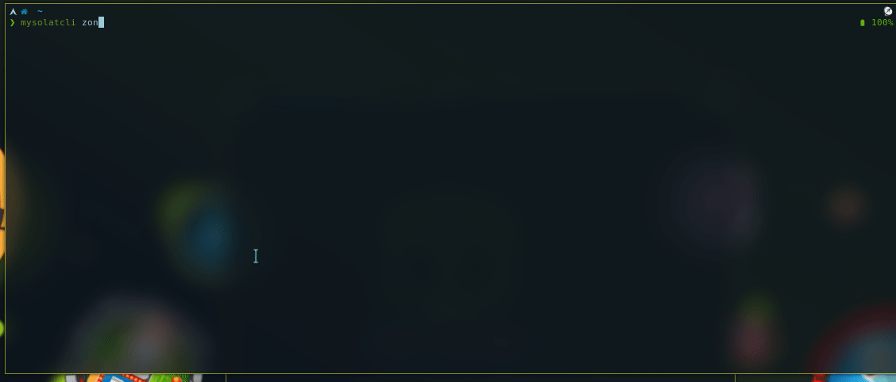

CLI for Malaysia Prayer Time
================

Simple CLI tool to make it easy to get Malaysia prayer time from the command line. It uses this [API wrapper](https://api.azanpro.com)

Usage
--------

**Install**

```bash
pip install . --user
```


**Jadual**

You can list table of the prayer time for particular location. Just use the jadual and followed by locations (-l) command.
```bash
❯ mysolatcli jadual -h
usage: solat jadual [-h] -l lokasi [-m] [-f field [field ...]]

optional arguments:
  -h, --help            show this help message and exit
  -l lokasi, --lokasi lokasi
                        Show table based on location (Ex: gombak)
  -m, --minggu          Print out prayer time for week
  -f field [field ...], --fields field [field ...]
                        only print this value (Ex: zohor isyak)
```
jadual -l "location"

```bash
❯ mysolatcli jadual -l gombak
╒════════════╤═════════╤═════════╤════════╤═══════════╤═════════╕
│ date       │ subuh   │ zohor   │ asar   │ maghrib   │ isyak   │
╞════════════╪═════════╪═════════╪════════╪═══════════╪═════════╡
│ 23-05-2020 │ 05:49   │ 13:13   │ 16:36  │ 19:21     │ 20:35   │
╘════════════╧═════════╧═════════╧════════╧═══════════╧═════════╛
```
fields options

```bash
❯ mysolatcli jadual -l gombak -f subuh asar zohor
╒════════════╤═════════╤════════╤═════════╕
│ date       │ subuh   │ asar   │ zohor   │
╞════════════╪═════════╪════════╪═════════╡
│ 23-05-2020 │ 05:49   │ 16:36  │ 13:13   │
╘════════════╧═════════╧════════╧═════════╛
```

minggu (-m/--minggu) options

```bash
❯ mysolatcli jadual -ml gombak
╒════════════╤═════════╤═════════╤════════╤═══════════╤═════════╕
│ date       │ subuh   │ zohor   │ asar   │ maghrib   │ isyak   │
╞════════════╪═════════╪═════════╪════════╪═══════════╪═════════╡
│ 18-05-2020 │ 05:50   │ 13:12   │ 16:35  │ 19:20     │ 20:34   │
├────────────┼─────────┼─────────┼────────┼───────────┼─────────┤
│ 19-05-2020 │ 05:50   │ 13:13   │ 16:35  │ 19:20     │ 20:34   │
├────────────┼─────────┼─────────┼────────┼───────────┼─────────┤
│ 20-05-2020 │ 05:50   │ 13:13   │ 16:36  │ 19:21     │ 20:34   │
├────────────┼─────────┼─────────┼────────┼───────────┼─────────┤
│ 21-05-2020 │ 05:49   │ 13:13   │ 16:36  │ 19:21     │ 20:35   │
├────────────┼─────────┼─────────┼────────┼───────────┼─────────┤
│ 22-05-2020 │ 05:49   │ 13:13   │ 16:36  │ 19:21     │ 20:35   │
├────────────┼─────────┼─────────┼────────┼───────────┼─────────┤
│ 23-05-2020 │ 05:49   │ 13:13   │ 16:36  │ 19:21     │ 20:35   │
├────────────┼─────────┼─────────┼────────┼───────────┼─────────┤
│ 24-05-2020 │ 05:49   │ 13:13   │ 16:37  │ 19:21     │ 20:35   │
╘════════════╧═════════╧═════════╧════════╧═══════════╧═════════╛
```

**Zone**

You can see info for zone with zon command.

```bash
❯ mysolatcli zon
╒════════╤═════════════════╤═══════════════════════════════════════════════════════════════════════════════════════════════╕
│ zone   │ negeri          │ lokasi                                                                                        │
╞════════╪═════════════════╪═══════════════════════════════════════════════════════════════════════════════════════════════╡
│ JHR01  │ Johor           │ Pulau Aur,Pemanggil                                                                           │
├────────┼─────────────────┼───────────────────────────────────────────────────────────────────────────────────────────────┤
│ JHR02  │ Johor           │ Kota Tinggi,Mersing,Johor Bahru                                                               │
├────────┼─────────────────┼───────────────────────────────────────────────────────────────────────────────────────────────┤
│ JHR03  │ Johor           │ Kluang,Pontian                                                                                │
├────────┼─────────────────┼───────────────────────────────────────────────────────────────────────────────────────────────┤
│ JHR04  │ Johor           │ Batu Pahat,Muar,Segamat,Gemas                                                                 │
├────────┼─────────────────┼───────────────────────────────────────────────────────────────────────────────────────────────┤
│ KDH01  │ Kedah           │ Kota Setar,Kubang Pasu,Pokok Sena                                                             │
├────────┼─────────────────┼───────────────────────────────────────────────────────────────────────────────────────────────┤
│ KDH02  │ Kedah           │ Pendang,Kuala Muda,Yan                                                                        │
├────────┼─────────────────┼───────────────────────────────────────────────────────────────────────────────────────────────┤
│ KDH03  │ Kedah           │ Padang Terap,Sik                                                                              │
├────────┼─────────────────┼───────────────────────────────────────────────────────────────────────────────────────────────┤
│ KDH04  │ Kedah           │ Baling                                                                                        │
├────────┼─────────────────┼───────────────────────────────────────────────────────────────────────────────────────────────┤
│ KDH05  │ Kedah           │ Kulim,Bandar Bahru                                                                            │
├────────┼─────────────────┼───────────────────────────────────────────────────────────────────────────────────────────────┤
│ KDH06  │ Kedah           │ Langkawi                                                                                      │
├────────┼─────────────────┼───────────────────────────────────────────────────────────────────────────────────────────────┤
│ KDH07  │ Kedah           │ Gunung Jerai                                                                                  │
├────────┼─────────────────┼───────────────────────────────────────────────────────────────────────────────────────────────┤
│ KTN01  │ Kelantan        │ Kota Bahru,Bachok,Pasir Puteh,Tumpat,Pasir Mas,Tanah Merah,Machang,Kuala Krai,Mukim Chiku     │
├────────┼─────────────────┼───────────────────────────────────────────────────────────────────────────────────────────────┤
│ KTN03  │ Kelantan        │ Jeli,Gua Musang,Mukim Galas,Bertam                                                            │
├────────┼─────────────────┼───────────────────────────────────────────────────────────────────────────────────────────────┤
│ MLK01  │ Melaka          │ Bandar Melaka,Alor Gajah,Jasin,Masjid Tanah,Merlimau,Nyalas                                   │
├────────┼─────────────────┼───────────────────────────────────────────────────────────────────────────────────────────────┤
│ NGS01  │ Negeri Sembilan │ Jempol,Tampin                                                                                 │
├────────┼─────────────────┼───────────────────────────────────────────────────────────────────────────────────────────────┤
```

**Zone within states**

You can get all zones and locations for a state with -n/--negeri flag

```bash
❯ mysolatcli zon -n selangor
╒════════╤══════════╤═══════════════════════════════════════════════════════════════════╕
│ zone   │ negeri   │ lokasi                                                            │
╞════════╪══════════╪═══════════════════════════════════════════════════════════════════╡
│ SGR01  │ Selangor │ Gombak,Hulu Selangor,Rawang,Hulu Langat,Sepang,Petaling,Shah Alam │
├────────┼──────────┼───────────────────────────────────────────────────────────────────┤
│ SGR02  │ Selangor │ Sabak Bernam,Kuala Selangor                                       │
├────────┼──────────┼───────────────────────────────────────────────────────────────────┤
│ SGR03  │ Selangor │ Klang,Kuala Langat                                                │
╘════════╧══════════╧═══════════════════════════════════════════════════════════════════╛
```

**Info for particular zone**

-z/--zonkod to print infos for zone

```bash
❯ mysolatcli zon -z sgr01
╒═══════════╤═════════════════════════════════════════════════════════════════════════════════════════╕
│ zone      │ SGR01                                                                                   │
├───────────┼─────────────────────────────────────────────────────────────────────────────────────────┤
│ tarikh    │ 23-05-2020                                                                              │
├───────────┼─────────────────────────────────────────────────────────────────────────────────────────┤
│ locations │ ['Gombak', 'Hulu Selangor', 'Rawang', 'Hulu Langat', 'Sepang', 'Petaling', 'Shah Alam'] │
├───────────┼─────────────────────────────────────────────────────────────────────────────────────────┤
│ azan      │ subuh: 05:49                                                                            │
│           │ zohor: 13:13                                                                            │
│           │ asar: 16:36                                                                             │
│           │ maghrib: 19:21                                                                          │
│           │ isyak: 20:35                                                                            │
╘═══════════╧═════════════════════════════════════════════════════════════════════════════════════════╛
```

Suggestions or Contribute
------------------

Any request or contribution to extend this tool are most welcome. If you find any issues or bugs, please open it in issue tracker, I'll try my best to improve it. TQ
